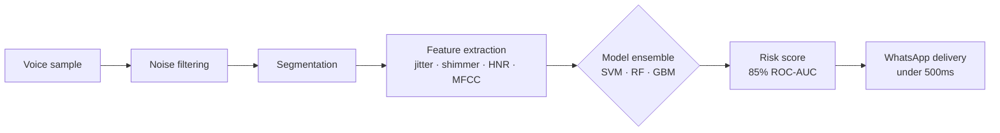
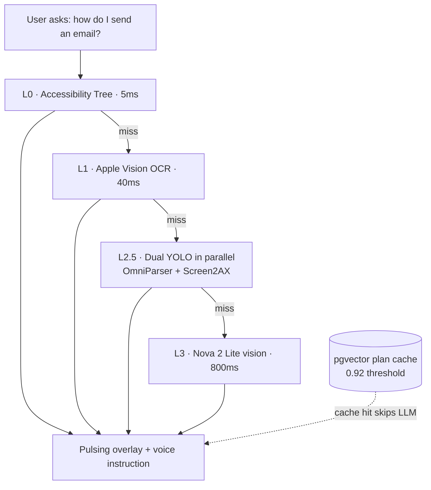

<!-- ================= HEADER ================= -->

  

  

---

## 👋 About me

Computer Engineering undergrad at **Thapar Institute of Engineering & Technology** (2024–2028, CGPA **9.67/10**). First-generation engineer who learned cloud and ML through hackathons, free tiers, and AWS credits.

My pattern: **AI for underserved users.** Parkinson's screening over voice, smartphone guidance for the elderly, offline emergency response for zero-connectivity zones, financial literacy over WhatsApp for rural India. If the "default user" gets ignored by tech, that is who I build for.

- 🏆 **AWS AIdeas 2026 Global Champion** with CogniSense
- 🥈 Runner-Up at **HackTU 7.0** · 🥇 Winner at **NIT Delhi Codeslayers**
- 🧩 **270+ LeetCode** problems solved
- 🔭 Currently building: **Sahayak** — macOS AI guidance app with a multi-layer screen-understanding pipeline

---

## 🛠️ Tech stack

**Languages**

**ML / AI**

**Backend & Cloud**

**Frontend & Mobile**

---

## 🚀 Flagship projects

### 🏆 CogniSense — ML-based Parkinson's Screening · *AWS AIdeas 2026 Global Champion*

> Screening pipeline using voice, facial, and motor signals — delivered over WhatsApp so it works on any phone.

- **85% ROC-AUC** on clinical Parkinson's risk classification, **<500ms** inference latency
- 30+ acoustic features (jitter, shimmer, HNR, MFCC), benchmarked across SVM, Random Forest, and Gradient Boosting
- Live demo shipped to international judges; selected champion from a global pool

`Python` `scikit-learn` `Signal Processing` `AWS Bedrock` `REST APIs`

🔗 [github.com/Cogni-sense1](https://github.com/Cogni-sense1)

<b>🧠 How the ML pipeline works (click to expand)</b>

 

---

### 🖥️ Sahayak — macOS AI Guidance for Non-Technical Users

> Menu bar app that walks elderly and non-technical users through any software task with a pulsing on-screen overlay plus voice instructions.

- Multi-layer screen detection: Accessibility Tree (**5ms**) to Apple Vision OCR (**40ms**) to dual YOLO in parallel to Nova 2 Lite fallback (**800ms**)
- Semantic plan cache with **pgvector** (0.92 similarity threshold) to cut redundant LLM calls
- Successor to **Waylo** (Android), which used a three-tier detection pipeline with a failure-logging flywheel for continuous YOLO retraining

`Swift` `SwiftUI` `AppKit` `Node.js` `FastAPI` `AWS Bedrock` `Aurora PostgreSQL + pgvector`

🔗 Waylo: [github.com/waylo-1](https://github.com/waylo-1)

<b>⚡ The detection cascade (click to expand)</b>

 

Cheapest layer first. The LLM is the last resort, not the first call.

---

### 📊 Amex Campus Challenge 2026 — Unsupervised Profitability Ranking

> Rank 500k cardmembers by profitability with **no ground-truth labels**, scored on top-20% overlap.

- Best public leaderboard score: **0.919**
- Method: economic P&L modeling, probe-based submissions, formula inversion, set reconstruction, proportion-supervised GBM
- Key insight: diverse consensus rankings beat concentrated approaches

`Python` `EDA` `Gradient Boosting` `Feature Engineering`

---

### 🧍 Rehabify — Gamified CV Physiotherapy

> Real-time pose estimation that turns physio exercises into a guided, gamified feedback loop.

- **90%+** motion detection accuracy tracking 33 body landmarks with joint-angle computation and automated rep-counting
- Full-stack: React frontend, Node.js backend, ML inference over REST APIs

`Python` `MediaPipe` `React` `Node.js`

🔗 [github.com/Rehabify-GamifiedPhysiotherapy](https://github.com/Rehabify-GamifiedPhysiotherapy)

---

### 🆘 ResQAI — Offline-First Emergency Response PWA

> Emergency guidance that works with **zero internet**, built for rural and low-connectivity environments.

- Locally hosted Gemma LLM (Ollama) with RAG over WHO and Red Cross protocols using local vector embeddings, covering 9 incident types
- Severity triage engine (Critical / High / Moderate / Low) plus multilingual voice I/O in Hindi, Punjabi, and English

`React` `TypeScript` `PWA` `Gemma / Ollama` `RAG` `IndexedDB`

🔗 [github.com/ResQAI1](https://github.com/ResQAI1)

---

### 💸 Financio — Financial Literacy over WhatsApp

> NLP-driven financial learning for rural users, with no app install needed.

- **35% reduction** in concept learning time across test users
- Node.js/Express and MongoDB backend serving personalized simulations through WhatsApp

`Node.js` `Express` `MongoDB` `WhatsApp API` `NLP`

🔗 [github.com/FinanciomitraAi](https://github.com/FinanciomitraAi)

---

<b>🌏 More builds (click to expand)</b>

 

**ClimateWatch India — ISRO Hackathon** · Hyperlocal monsoon-failure predictor with an animated climate time-machine. `Python/xarray` `ConvLSTM (PyTorch)` `FastAPI` `React + Deck.gl/Mapbox` `D3.js`

**CommunityOS (CrisisLens)** · 🔗 [github.com/communityos-crisislens](https://github.com/communityos-crisislens)

**3D Portfolio** · Scroll-driven site with a particle-field hero and skill constellation. `Three.js` `React Three Fiber` `GSAP` `Next.js 14` · 🔗 [Live site](https://portfolio-wheat-xi-79.vercel.app/)

---

## 📈 GitHub stats

---

## 🏅 Achievements

| | |
|---|---|
| 🏆 | **AWS AIdeas 2026 Global Champion** — CogniSense, international panel-judged competition |
| 🥈 | **Runner-Up, HackTU 7.0** |
| 🥇 | **Winner, Codeslayers Hackathon**, NIT Delhi |
| 📊 | **0.919** best public score, Amex Campus Challenge 2026 |
| 🧩 | **270+** LeetCode problems (DP, graphs, Dijkstra, Kosaraju SCC, Rabin-Karp) |
| 🎓 | **9.67/10 CGPA** at TIET · ML Specialization (DeepLearning.AI x Stanford, all 3 courses) |

---

## 🤝 Beyond code

Technical Member — **Saturnalia Tech Fest** · **MarkFin Society** · **Echoes Media Club** @ TIET

---

### 💬 If you are building something for users the industry forgot, let us talk.

